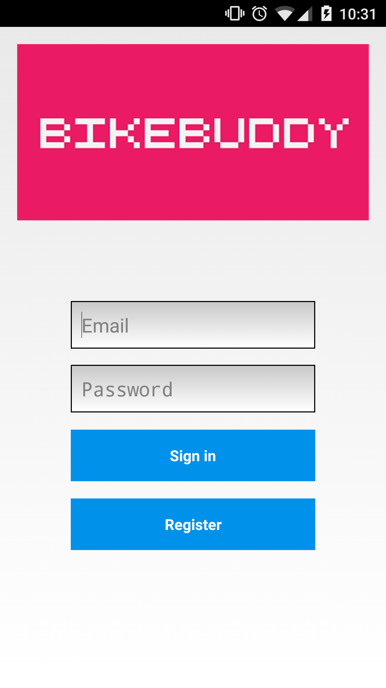

# BikeBuddy

BikeBuddy is an Android application that promotes Villo!-stations in Brussels with a deficit of available bicycles.

By using a bonus point system, users get motivated to do an extra effort to bring bicycles to higher located stations and get free 'bicycle-time' in return.

# Screenshots

# Scanner

To scan, install <a href="https://play.google.com/store/apps/details?id=com.google.zxing.client.android&hl=nl">Barcode Scanner</a>

# RestServer

Use HomeStead as development environment. Installation instructions: http://laravel.com/docs/5.0/homestead

Laravel, a PHP framework is used: http://laravel.com/

Go into your Vagrant-box: `vagrant ssh`
Go to your project folder and run:
`php artisan migrate` to load datatables and
`php artisan db:seed` to load dummy data and bikelocations

Routes:

http://n091-vm26-10.wall2.ilabt.iminds.be/auth/register
http://n091-vm26-10.wall2.ilabt.iminds.be/auth/login

http://n091-vm26-10.wall2.ilabt.iminds.be/stations 

http://n091-vm26-10.wall2.ilabt.iminds.be/profile/{emailadress} 
http://n091-vm26-10.wall2.ilabt.iminds.be/scoreboard 
http://n091-vm26-10.wall2.ilabt.iminds.be/scan -> POST-parameters: 'email', 'code'

# Disclaimer

This project was made for the course 'Design and Development of Mobile Applications'.
UGent, 2014-2015

